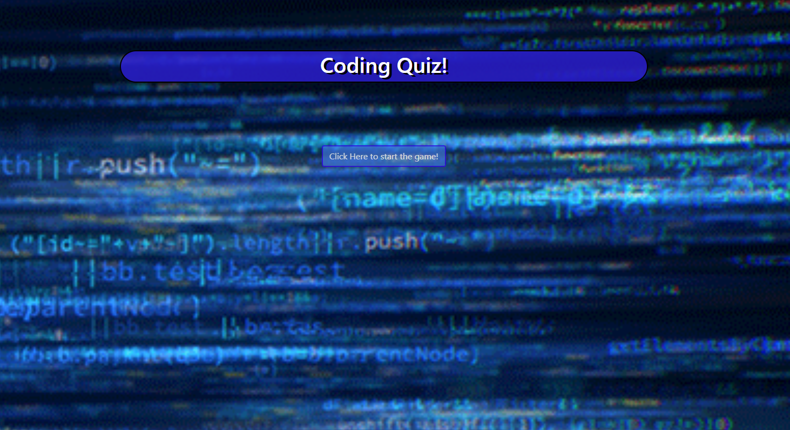

# Trivia Game
A trivia quiz on coding questions!

## Example
<br>
[Click here to start playing](https://tintdang.github.io/coding-quiz/)

## Getting Started
```
git clone git@github.com:tintdang/coding-quiz.git
open index.html in your favorite browser
```

## Instructions

* This is a trivia game that will show one question until the player answers it or the timer runs out.
* These questions are related to coding
* The game will have 10 questions for the user to answer
* On the final screen, it will show how many correct answers, incorrect answers, and timed out answers that the user has made, and an option to restart the game.

## Features
* The quiz questions will always be in a random order


 ## Built With
- HTML & CSS
- Javascript
- [Bootstrap](https://getbootstrap.com/)
- [jQuery](https://jquery.com/download/)

## Author

* **Tin Dang**  - [tintdang](https://github.com/tintdang)

## Acknowledgments

* Thanks to The Coding Boot Camp at UT Austin


## Addtional comments
- [ ] Set randomized array as its own variable